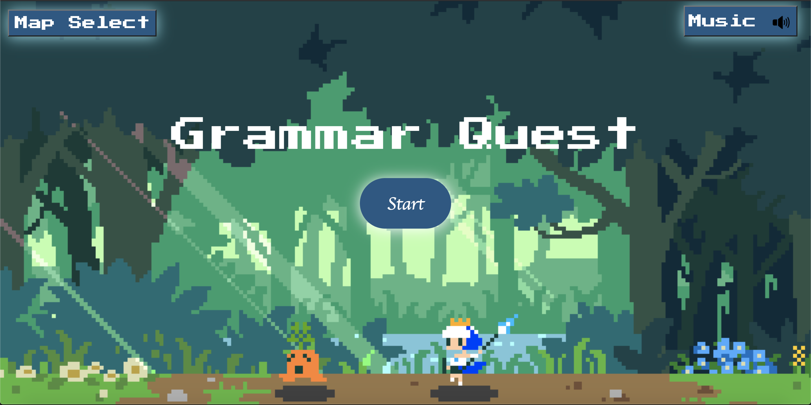

# 
Preview

</img>

---

## 
Description

Grammar Quest is a game created for kids aged 3-12 years old. It features questions with a missing word in which the player clicks the correct option to fill it in. There is a score counter to keep track of score, as well as a map selection option for the player to choose the map & music they want to play with. 

---

### 
Languages Used

- HTML
- CSS
- Javascript

---
### 
Credits

Developers
<a href="https://github.com/AstroMike101">AstroMike101</a>
<a href="https://github.com/ec-rilo">ec-rilo</a>

Music from: https://www.fesliyanstudios.com/royalty-free-music/downloads-c/8-bit-music/6

Images from : 
https://www.deviantart.com/retrostetic/art/8-BIT-Sea-Animated-786289622
https://cdn-images-1.medium.com/max/2000/1*q-z_t3BN8DrKJaUXXvMlLA.gif
https://gifer.com/en/SxQ

[Back To The Top](#Preview)

---
## License

MIT License

Copyright (c) [2021] [AstroMike101 & Ec-Rilo]

Permission is hereby granted, free of charge, to any person obtaining a copy
of this software and associated documentation files (the "Software"), to deal
in the Software without restriction, including without limitation the rights
to use, copy, modify, merge, publish, distribute, sublicense, and/or sell
copies of the Software, and to permit persons to whom the Software is
furnished to do so, subject to the following conditions:

The above copyright notice and this permission notice shall be included in all
copies or substantial portions of the Software.

THE SOFTWARE IS PROVIDED "AS IS", WITHOUT WARRANTY OF ANY KIND, EXPRESS OR
IMPLIED, INCLUDING BUT NOT LIMITED TO THE WARRANTIES OF MERCHANTABILITY,
FITNESS FOR A PARTICULAR PURPOSE AND NONINFRINGEMENT. IN NO EVENT SHALL THE
AUTHORS OR COPYRIGHT HOLDERS BE LIABLE FOR ANY CLAIM, DAMAGES OR OTHER
LIABILITY, WHETHER IN AN ACTION OF CONTRACT, TORT OR OTHERWISE, ARISING FROM,
OUT OF OR IN CONNECTION WITH THE SOFTWARE OR THE USE OR OTHER DEALINGS IN THE
SOFTWARE.

[Back To The Top](#Preview)

